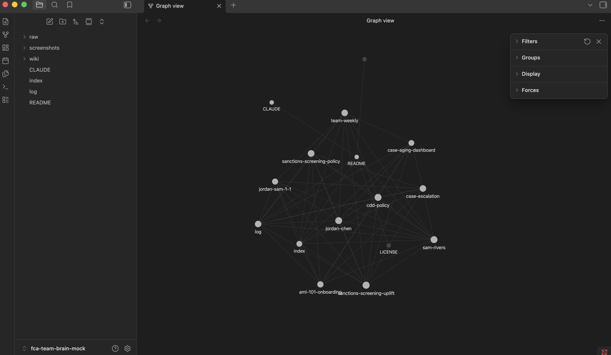
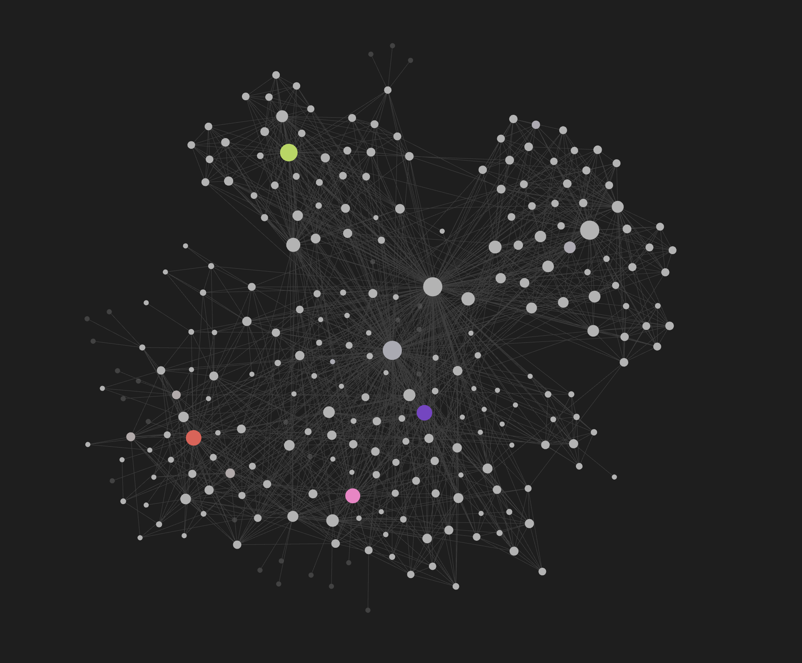
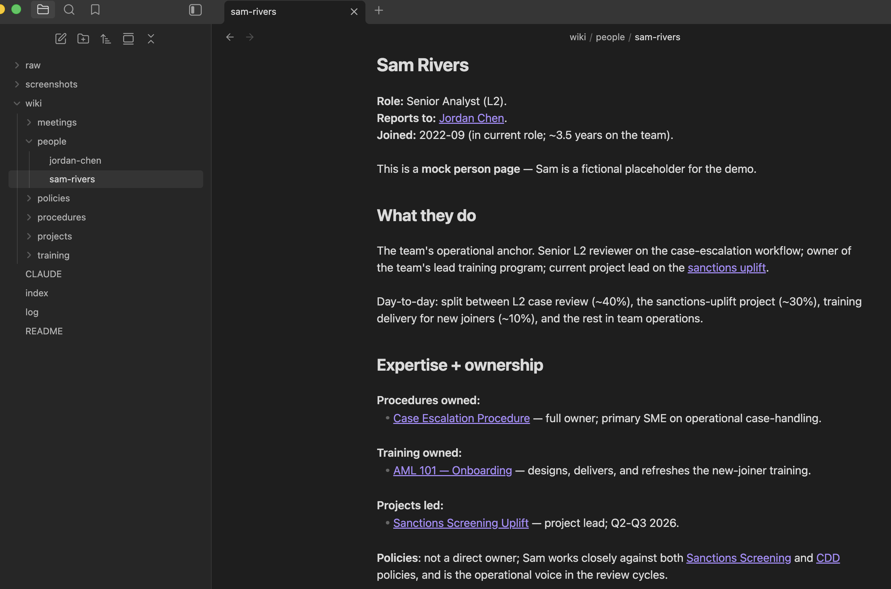
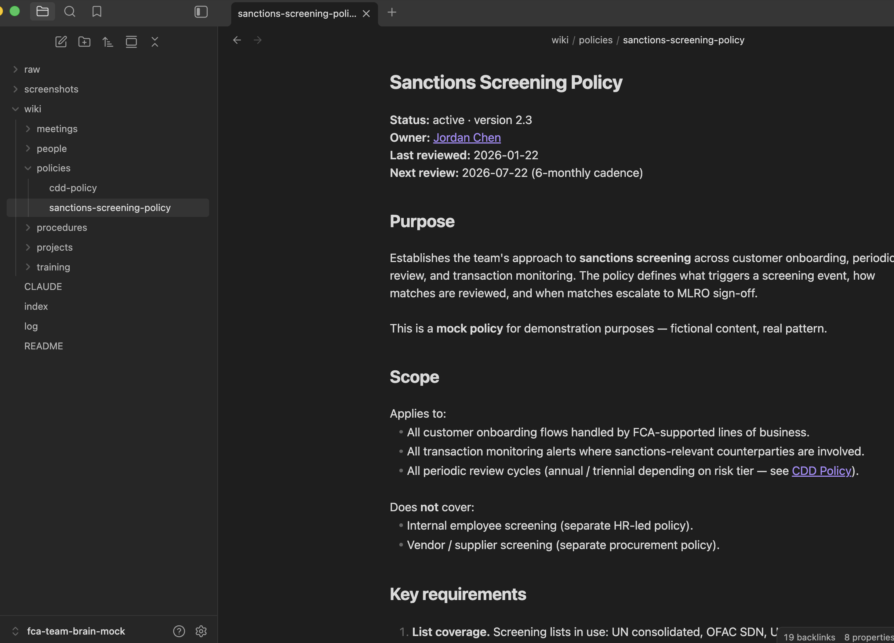
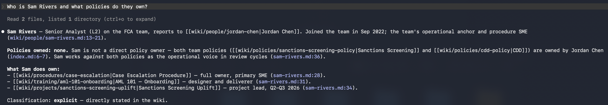
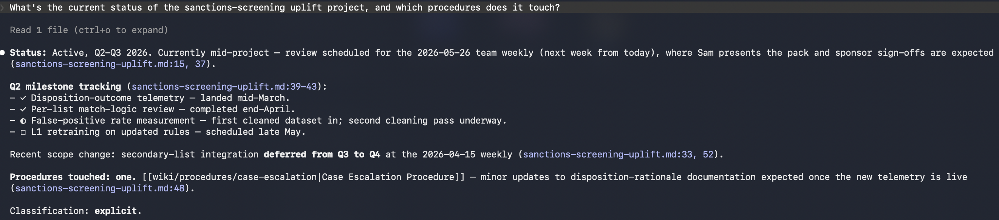
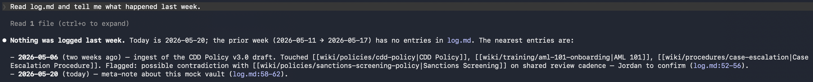

# FCA Team Brain — Mock Demo

A **mock corporate knowledge base** demonstrating the [LLM-Wiki Pattern](https://gist.github.com/karpathy/442a6bf555914893e9891c11519de94f) in practice. This repo is *not* a real bank team brain — it's a fictional Financial-Crime-Analytics (FCA) team's wiki, generated as a demonstration artifact.

**Built as prep for a corporate brainstorm session on whether to adopt this pattern internally.** All content is fictional.



*Graph view of the mock vault. Every node is a wiki page; every line is a `[[link]]` between them. The LLM-Wiki Pattern is what produces a graph this dense — every cross-reference is maintained as the wiki grows, because the LLM doesn't forget.*

…and here's what the same pattern looks like at meaningful scale — a single LLM-Wiki vault grown over months of regular ingests:



*The visible structure stays whole because the LLM maintains every cross-reference on every ingest. Traditional wikis decay as they grow — links rot, cross-references go stale, page volume outpaces maintenance effort. The LLM-Wiki Pattern doesn't, because the bookkeeping is the LLM's job. **This is what "compounding" looks like.***

---

## What is this pattern?

> *"The LLM has already done the synthesis; you read the result."*

The **LLM-Wiki Pattern** is an alternative to RAG. Instead of an LLM searching through raw documents at query time, the LLM **incrementally builds and maintains a persistent wiki** that sits between the user and the raw sources. The wiki is a compounding artifact:

- **Cross-references are pre-computed.** Every named entity (person, policy, project, procedure) gets a page; every mention becomes a `[[link]]`.
- **Contradictions are flagged where they live.** When a new source contradicts an existing claim, the LLM updates the affected page with both versions and flags the tension.
- **Synthesis already reflects everything ingested.** Each new source isn't just indexed — it's *integrated* into the existing wiki.

The result: a team knowledge base that **gets more useful over time**, not less, because the LLM keeps it coherent.

## Why it matters at team scale

Most corporate knowledge bases die from the **bookkeeping problem**: maintenance burden grows faster than value. Pages go stale, links rot, no one updates the cross-references. SharePoint is *storage*; it isn't *retrieval*.

The LLM-Wiki Pattern moves the bookkeeping to an LLM that's cheap and tireless at exactly that task. Humans curate sources, direct analysis, ask questions. The LLM does everything else:

| | Traditional wiki | RAG | LLM Wiki |
|---|---|---|---|
| Cross-references | Manual, decay over time | Re-derived per query | Pre-computed, persisted |
| Contradictions | Often missed | Often missed | Flagged on the affected page |
| Compounds with use? | No (decays) | No (stateless) | **Yes** |
| Where work happens | Authoring time | Query time | Ingest time |

## What you'll find in this repo

```
fca-team-brain-mock/
├── CLAUDE.md              # the operating manual — read first
├── README.md              # you are here
├── index.md               # catalog of every wiki page
├── log.md                 # chronological record of ingests + queries
├── wiki/
│   ├── policies/          # team policies (sanctions screening, CDD)
│   ├── procedures/        # operational workflows (case escalation)
│   ├── training/          # onboarding materials (AML 101)
│   ├── meetings/          # weekly minutes, 1:1s
│   ├── people/            # team-member pages
│   └── projects/          # active workstreams
└── screenshots/           # captured visuals (graph view + Claude Code interactions)
```

## How to read this repo (5 minutes)

1. **Open [`CLAUDE.md`](./CLAUDE.md)** — the operating manual. This is what disciplines the LLM into being a wiki maintainer rather than a generic chatbot. The schema *is* the pattern.
2. **Skim [`index.md`](./index.md)** — see the full content catalog. Notice how every page has a one-line summary; this is what the LLM reads first on every query.
3. **Open a wiki page** — e.g. [`wiki/people/sam-rivers.md`](./wiki/people/sam-rivers.md). Notice the dense `[[wiki-links]]` to other pages. The graph is part of the value.
4. **Check [`log.md`](./log.md)** — chronological record of ingests, queries worth keeping, and lints. Demonstrates how the brain accumulates.
5. **Open this repo in Obsidian and view the graph** — the visual interconnection lands the differentiator faster than any explanation.

## What the pages look like

Two sample pages — a person and a policy — in Obsidian preview:

| `wiki/people/sam-rivers.md` | `wiki/policies/sanctions-screening-policy.md` |
|---|---|
|  |  |

Notice the **backlinks counter in the bottom-right** of each page — Obsidian surfaces every page that links *into* this one. At team scale, this is how you find "everything that touches sanctions screening" without grep.

## What the LLM does that humans don't

When a new artifact lands — a meeting transcript, a regulatory update, a customer-case write-up — the LLM:

1. **Reads it in full.**
2. **Discusses takeaways with the user** before writing anything (pre-write discussion is non-negotiable; the user steers emphasis *before* the wiki changes).
3. **Updates 5-15 affected pages in one pass** — the policy page, the procedure page, the training page, the relevant person pages, the project pages.
4. **Updates the index + appends to the log.**
5. **Reports back**: every page touched, contradictions flagged, anything sensitive.

A traditional wiki: one person writes one page. The cross-references decay.
This wiki: the LLM touches every page that should know about the new artifact. **Nothing decays.**

## Sample queries this brain can answer

> *"What did we decide about high-risk customer escalation in Q1?"*
> *"Who on the team has expertise on sanctions screening?"*
> *"Which policies has the CDD-uplift project affected?"*
> *"Where in the AML training do we cover the case-escalation procedure?"*

The brain reads `index.md`, traverses the relevant `[[links]]`, and returns a sourced answer — without re-deriving the synthesis from raw documents every time.

## What the LLM does with it

Open this folder in Claude Code (or any agentic LLM with file-system tool use) and ask questions. The LLM reads the schema, consults `index.md`, follows the relevant `[[wiki-links]]`, and answers with **inline citations + a classification of the answer** — *explicit* (stated directly in the wiki), *inferred* (reasonable from adjacent content), or *unknown* (no signal — say so, don't guess).

Three real interactions captured against this exact repo:

### Query 1 — "Who is Sam Rivers and what policies do they own?"



The interesting move is the **distinction Sam doesn't own any policies, but does work against both**. A RAG system retrieving fragments would likely conflate these. The LLM-Wiki Pattern doesn't, because the wiki itself drew the distinction at ingest time.

### Query 2 — "What's the current status of the sanctions-screening uplift project, and which procedures does it touch?"



Notice how the answer reaches **across pages** — project page for status, meeting page for the scope change, procedure page for the cross-link. That's the synthesis property the wiki layer makes free.

### Query 3 — "Read log.md and tell me what happened last week."



The **honest-negative-result** behavior is the discipline the schema enforces. The LLM doesn't fabricate activity to fill the answer — it tells you the window is empty and shows you the nearest real entries.

---

## Required ingredients (what makes this work)

This pattern needs five things — see [`CLAUDE.md`](./CLAUDE.md) for the full operating model:

1. **A `CLAUDE.md`-style schema file** that the LLM reads first every session. Without it, the LLM regresses to chatbot behavior.
2. **Plain markdown files** in a folder structure — the substrate.
3. **An LLM with file-system tool use** (Read, Write, Edit, Grep). Not a chat UI.
4. **An `index.md`** that's actually maintained — the LLM consults it first on every query.
5. **A grep-parseable `log.md`** — recent activity is recoverable cheaply.

The substrate is replaceable. Obsidian / Logseq / SharePoint markdown / Confluence — all viable. The LLM access is the bottleneck.

## Adapting this for an actual team

1. **Fork or copy this repo** into your team's source-control system.
2. **Adapt [`CLAUDE.md`](./CLAUDE.md)** to your team's vocabulary and content types — the schema *must* be co-evolved with the LLM. Generic schemas yield generic output.
3. **Decide where Layer 2 lives** — the LLM-readable `.md` mirror of your team's actual content (Word docs, PowerPoints, emails). Originals stay where they are; the mirror is a build artifact.
4. **Run the four operations** — ingest, query, lint, refactor — on a regular cadence.

## License

MIT — see [LICENSE](./LICENSE).

## Credits

- The LLM-Wiki Pattern is articulated in [this 2026 gist](https://gist.github.com/karpathy/442a6bf555914893e9891c11519de94f). The pattern itself sits in the lineage of [Vannevar Bush's Memex](https://en.wikipedia.org/wiki/Memex) (1945) — a personal, curated, associatively-linked knowledge store. Bush couldn't solve who would maintain it. LLMs solve that.
- This mock vault is the product of one person's prep for a corporate brainstorm, built in a few focused hours using Claude Code.
